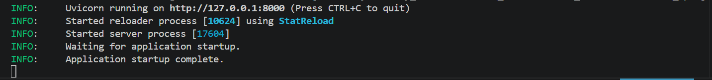
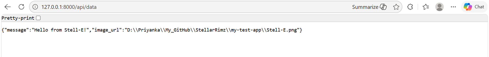
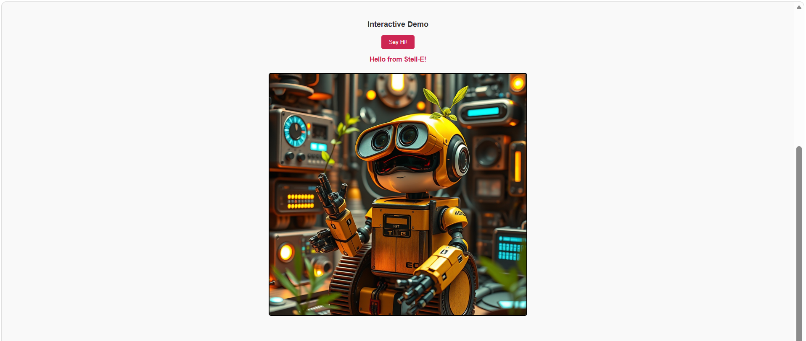

# STELLAR_RIMZ
APIs for StellarRimz

## Create a Virtual Environment for the project
python -m venv .venv  

### Launch the virtual environment
Set-ExecutionPolicy -Scope Process -ExecutionPolicy Bypass
.\.venv\Scripts\Activate.ps1     

## Pre-requisites:
Python 3.9 and higher
FastAPI

## Install Dependencies:

pip install -r requirements.txt

## Run the FastAPI
uvicorn fastapi_backend:app --reload

The application should start:

Go to URL: http://127.0.0.1:8000/api/data
The Hello message should appear as below.

Open stellarrimz_api/stellarrimz_welcome2.html in a browser. The main API page will appear.

Go to Interactive Demo:
Click "Say Hi!"

Stell-E will respond.

